# JavaScript

---

使用 javaScript 严格模式

```javascript
'use strict';
```

**什么是严格模式？**

采用具有限制性 JavaScript 变体的一种方式，从而使代码隐式地脱离“马虎模式/稀松模式/懒散模式“（sloppy）模式。

1. 严格模式通过抛出错误来消除了一些原有静默错误。
2. 严格模式修复了一些导致 JavaScript 引擎难以执行优化的缺陷：有时候，相同的代码，严格模式可以比非严格模式下运行得更快。
3. 严格模式禁用了在 ECMAScript 的未来版本中可能会定义的一些语法。

https://developer.mozilla.org/zh-CN/docs/Web/JavaScript/Reference/Strict_mode

函数定义

- 使用函数声明的方式定义一个函数：

```javascript
function func(arg) {
    // FUNCATION BODY
} 
```

- 使用函数表达式的方式定义一个函数

```javascript
const func = function (arg) {
    // FUNCTION BODY
}
```

- 使用箭头函数的方式定义一个函数

```javascript
const func = (arg) => {
    // FUNCTION BODY
}
```

JavaScript Array 数组：

- 使用 `[ ]` 进行声明：

```javascript
const arr = ['A', 'B', 'c'];
```

- 使用 `new Array(args)` 创建：

```javascript
const arr = new Array('A', 'B', 'C');
```

内置函数：

- push：在数组末尾新增一个元素，返回数组长度
- unshift：在数组头新增加一个元素，返回数组长度
- pop：取出数组最后一个元素，返回取出元素
- shift：取出数组第一个元素，返回取出元素
- indexOf：定位元素在数组中的位置
- includes：判断是否包含指定元素，返回是否结果（严格）

JavaScript Object 对象：

---

JavaScript 如何控制网页中的DOM元素的样式与行为？

JavaScript 选择器 定位到具体的DOM元素，给DOM添加相应的监听事件，通过修改DOM元素的ClassList（样式列表），实现各种功能。

---

## JavaScript 引擎


### 作用域 和 作用域链

函数的调用顺序不会影响变量声明的作用域，函数声明时，函数能访问的变量作用域已经确定。

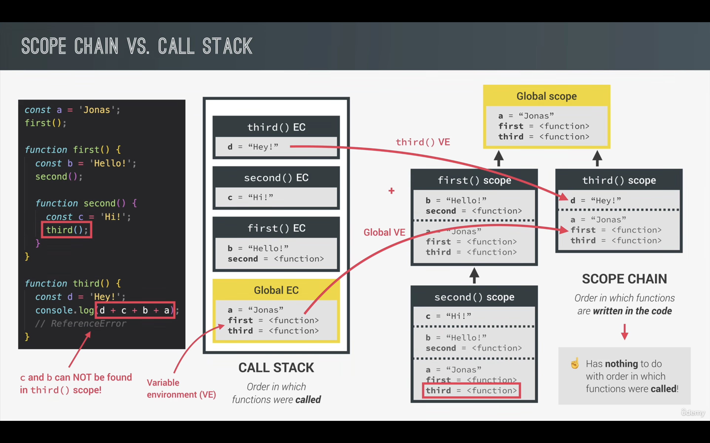

### 作用域提升

Hoisting 是 JavaScript 中的一个特性,它指的是变量和函数声明在代码执行之前会被"提升"(Hoist)到它们所在作用域的顶部。这意味着你可以在声明变量或函数之前就使用它们。

变量声明提升:

- 使用 var 声明的变量会被提升到它所在作用域的顶部,但赋值部分不会被提升。
- 使用 let 和 const 声明的变量也会被提升,但是与 var 不同的是,它们不会被初始化为 undefined,而是保持"未初始化"的状态,如果在声明之前访问它们,会抛出 ReferenceError。

函数声明提升:
- 使用函数声明语法 (function foo() {...}) 声明的函数会被完全提升,包括函数名和函数体。
- 使用函数表达式 (const foo = function() {...}) 声明的函数,只有变量声明会被提升,而函数赋值部分不会被提升。

### TDZ（Temporal Dead Zone）暂时性死区

ES6 明确规定，如果区块中存在let和const命令，这个区块对这些命令声明的变量，从一开始就形成了封闭作用域。凡是在声明之前就使用这些变量，就会报错。
只要块级作用域内存在let命令，它所声明的变量就“绑定”（binding）这个区域，不再受外部的影响。
ES6 规定暂时性死区和let、const语句不出现变量提升，主要是为了减少运行时错误，防止在变量声明前就使用这个变量，从而导致意料之外的行为。

暂时性死区的定义：

在代码块内，使用let命令声明变量之前，该变量都是不可用的。这在语法上，称为“暂时性死区”（temporal dead zone，简称 TDZ）。
暂时性死区的本质：

只要一进入当前作用域，所要使用的变量就已经存在了，但是不可获取，只有等到声明变量的那一行代码出现，才可以获取和使用该变量。

### this 关键字

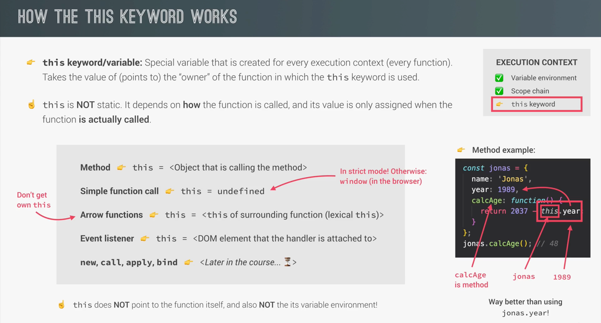

面向对象语言中 this 表示当前对象的一个引用。 但在 JavaScript 中 this 不是固定不变的，它会随着执行环境的改变而改变。

- 在浏览器全局作用域下，单独使用 this，this关键字指向全局对象（window对象）。
- 作为一个普通函数调用执行（没有明确对象进行调用），在严格模式下，this 是未定义的(undefined)。 
- 箭头函数中的 this 指向的是上一级作用域中的 this。
- 当一个函数被作为方法调用时（对象.方法()调用），在方法中，this 执行该方法调用的对象。
- 在事件中，this 表示接收事件的元素。 
- 类似 call() 和 apply() 方法可以将 this 引用到任何对象。

#### 常规函数 和 箭头函数 this 关键字陷阱


arguments 关键字用于接受普通函数传递进来的参数列表，仅存在于普通函数，对于箭头函数来说是不存在 arguments 关键字的。


---

### 数组解构：


### 对象结构：


## JavaScript 字符串 正则表达式


---

## JavaScript 函数


### call() 函数


### bind() 函数


### 立即调用函数表达式

立即调用函数表达式（IIFE）：

```javascript
(function () {
    // function body
})();
```

对于箭头函数同样适用：

```javascript
(() => {
    // function body
})();
```

### Closure 函数闭包

函数闭包的目的是：在ES6+语法中，函数作用域中定义的变量（const、let）只能在当前作用域（或其子作用域）能访问修改。
函数闭包通过定义函数的返回值是一个函数，该函数可以对函数作用域中的变量进行操作。

函数闭包避免了函数变量在不同作用域之间被污染的风险。

### Array 数组函数：

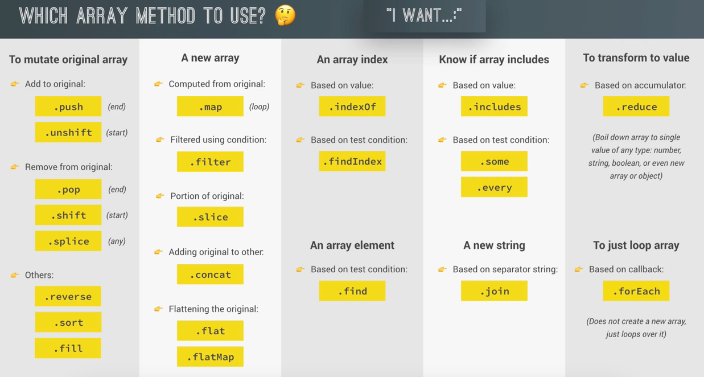

#### at 函数

#### foreach 方法

```javascript
array.forEach(callbackFn(currentValue, index, arr), thisValue)
```

- currentValue：当前元素
- index：当前元素的索引值
- arr：当前元素所属的数组对象

#### 数组转换函数

这组函数在执行结束后会返回一个全新的数组，而不是在原始对象上进行操作。

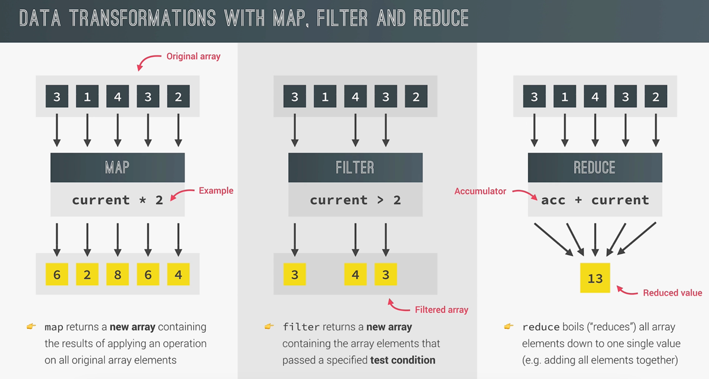

#### find 和 findindex 函数

```javascript

```

#### some 函数

```javascript

```

#### flat 和 flatmap 函数

- flat 展开数组元素到一个数组中（深度嵌套的元素都会被展开）

```javascript

```

#### 数组排序


#### Array.from() 创建数组

---

# Javascript 数值和时间

## Javascript 数值

Javascript 中的数值都是以浮点数进行表示的，无论在声明的时候使用的是整数还是浮点数，内部表示都是浮点数。

注意：Javascript 中的数字存在精度问题，因此在进行计算的过程中如果对于数字非常敏感的场景中需要针对这个问题进行处理。

## Javascript 时间


### 日期计算


## 国际化 API


## 定时器

### 延时调用 setTimeout：

延时调用：定义超时执行的函数，函数只会被调用一次。

- 定义延时调用函数：

```javascript
setTimeout(() => {
    // 延时执行的函数逻辑
}, 3000)  // 指定延时执行的时间（ms 毫秒）
```

可以给延时执行的函数传入参数：

```javascript
setTimeout((arg01, arg02) => {
    console.log(arg01, arg02)
}, "arg01", "arg02", 3000)
```

上面的 "arg01" 和 "arg02" 会传入到延时执行函数中。

- 取消延时调用：

在延时执行时间到之前，我们可以通过调用方法中断延时记时，从而使得延时函数的调用不会被触发。

```javascript
// 使用变量接受延时执行的定时器
const timer = setTimeout(() => {
    // 延时执行的函数逻辑
}, 3000);

// 取消执行
clearTimeout(timer);
```

### 定时调用 setInterval：

- 定义 定时调用

```javascript
setInterval(() => {
    // 定时调用函数逻辑
}, 3000)  // 定义调用时间间隔
```

- 取消 定时调用

```javascript
const interval = setInterval(() => {
    // 定时调用函数逻辑
}, 3000)

// 取消定时调用
clearInterval(interval)
```

---

# Web API

## HTML DOM API

Javascript 通过操作 DOM 来实现对网页内容的控制。DOM 是 Javascript 和网页页面内容的一个交互接口。

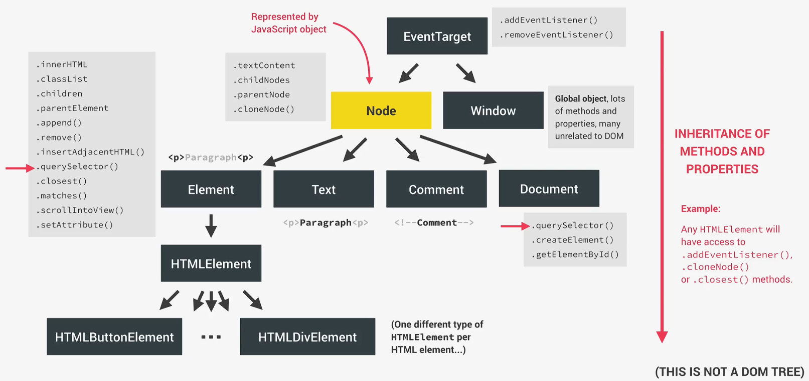

### 查询DOM元素

- `document.documentElement` 属性中保存了整个页面元素
- `document.head` 属性中保存了页面的头部信息（页面不可见）
- `document.body` 属性中保存了页面的主体信息（页面内容可见）

### 创建DOM元素

TIPS：在控制DOM节点元素的新增的同时，我们同样可以控制节点元素上的属性的修改（新增、更新、删除）

- `insertAdjacentHTML()` 

```javascript
insertAdjacentHTML(position, text)
```

```html
<!-- beforebegin -->
<p>
  <!-- afterbegin -->
  foo
  <!-- beforeend -->
</p>
<!-- afterend -->
```

### 删除DOM元素

- `元素.remove()`：移除指定元素的所有子元素节点

### DOM节点 样式、属性、选择器 控制

#### 样式

TIPS：在使用JavaScript控制样式时，样式属性名需要使用驼峰命名规则。

```javascript
// 控制元素节点的行内样式

```

#### 属性

`dataset` 可以获取DOM元素上的所有属性集合（包括自定义的属性）


#### 选择器

`classlist` 可以获取DOM元素上的所有选择器集合


### DOM 元素事件

MDN事件参考：https://developer.mozilla.org/zh-CN/docs/Web/Events

#### 添加事件

```javascript
// 给element元素添加一个监听事件，当事件触发时，执行回调函数
element.addEventListener('事件名称', function (event) {
    // 函数体
})
```

可以直接指定元素的事件属性来绑定触发事件时执行的回调函数：

```javascript
element.onmouseenter = function (e) {
    // 函数体
}
```

#### 事件冒泡

事件捕获是有DOM树顶层开始依次向下传递，会依次经过目标元素的祖先元素，到达目标元素后开始处理事件响应执行回调函数。

事件冒泡则是事件触发响应结束之后，沿着目标元素依次向DOM树顶层返回的过程，会依次经过目标元素的祖先元素。

在事件返回的过程中，如果祖先元素中也绑定了相应的事件处理的回调函数，那么也将会被触发。

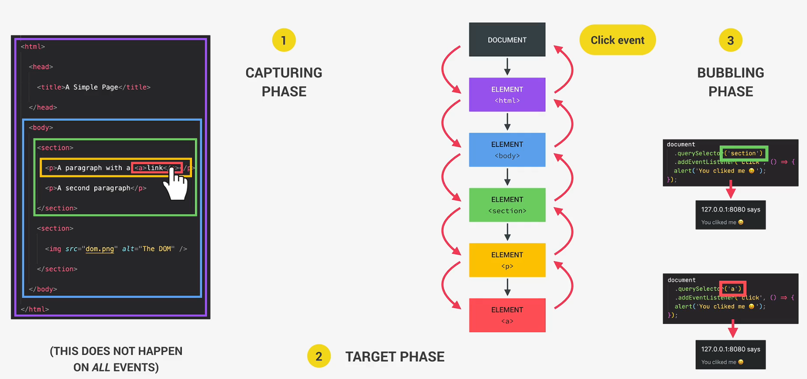

##### 阻止事件冒泡

```javascript
// 阻止element元素的事件冒泡，此时事件响应不会再沿着祖先元素进行返回
element.stopPropagation();
```

##### 事件委托

事件委托的实现通常涉及将事件监听器绑定到一个父元素上，而不是每个子元素上单独设置监听器。
当事件发生时，利用事件冒泡的特性，事件会传播到父元素，由父元素的监听器处理。
例如，如果有一个列表，你可以在列表的父元素上设置点击事件监听器，而不是在每个列表项上单独设置。

### DOM 遍历

### 交叉观察器 API

交叉观察器 API（Intersection Observer API）提供了一种异步检测目标元素与祖先元素或顶级文档的视口相交情况变化的方法。

交叉观察器 API 允许你配置一个回调函数，当以下情况发生时会被调用：

目标元素与设备视口或指定元素相交。在交叉观察器 API 中，指定元素被称为根元素或根。
观察器（Observer）第一次监听观察目标元素。
通常情况下，需要观察目标元素最近的可滚动祖先的交集变化，如果目标元素不是可滚动元素的后代，则需要观察设备视口的交集变化。要观察相对于设备视口的交集，请为 root 选项指定 null。请继续阅读有关交叉观察器选项的更详细说明。

无论你是使用视口还是其他元素作为根元素，API 的工作方式都是一样的，只要目标元素的可见性发生变化，与根元素的交集达到所需的程度，就会执行你提供的回调函数。

目标元素与其根元素的交集程度就是交叉比。它表示目标元素可见的百分比，数值介于 0.0 和 1.0 之间。

- 创建一个交叉观察器：

```javascript
let options = {
  root: document.querySelector("#scrollArea"),
  rootMargin: "0px",
  threshold: 1.0,
};

let observer = new IntersectionObserver(callback, options);
```

### DOM 事件生命周期

DOM生命周期事件包括DOMContentLoaded、load、beforeunload和unload，它们在不同的加载阶段触发，帮助开发者更好地管理页面加载和用户交互。

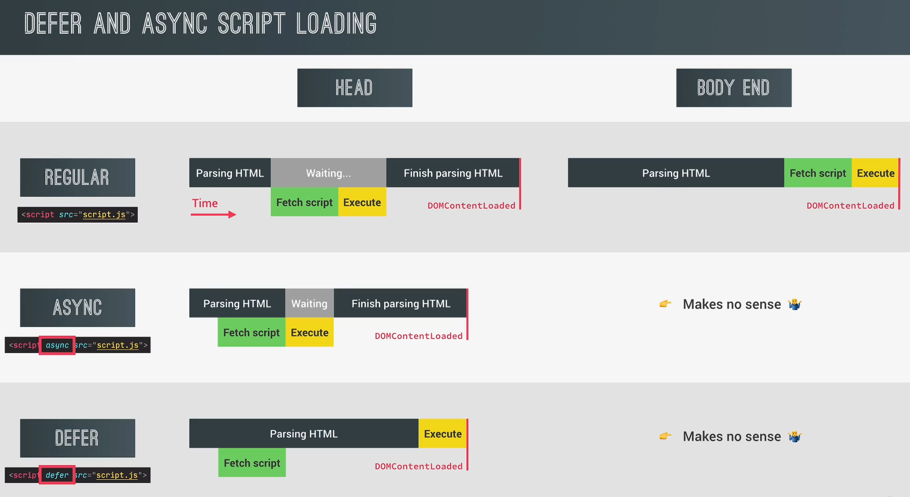

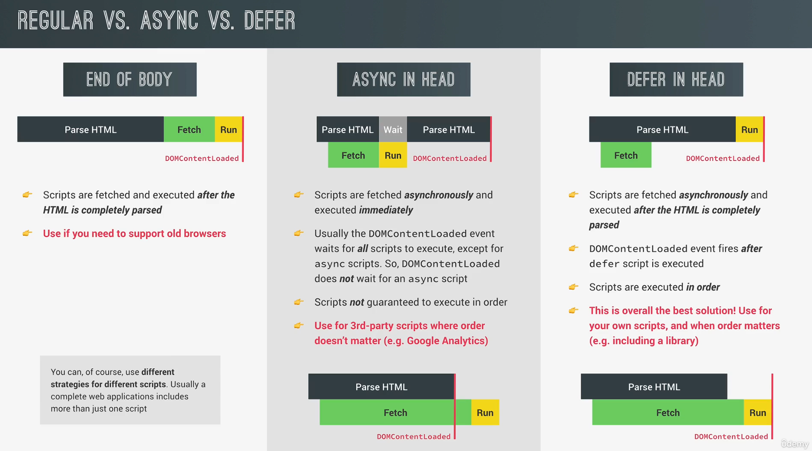


## Web Storage API


## Fetch API


## URL API

---

# First Project 

---

# ⚠️JavaScript 面向对象编程

## Prototype 原型

每个 JavaScript 对象都有一个与之关联的原型对象，通过原型对象，可以实现属性和方法的共享，从而减少内存占用。

所有的 JavaScript 对象都会从一个 prototype（原型对象）中继承属性和方法，JavaScript 对象可以访问原型对象上的属性和方法。

原型是一个对象，它是其他对象的模板或蓝图。当一个对象试图访问一个属性或方法时，如果在该对象自身没有找到，JavaScript 会沿着原型链向上查找，直到找到对应的属性或方法，或者达到原型链的顶端 null 为止。

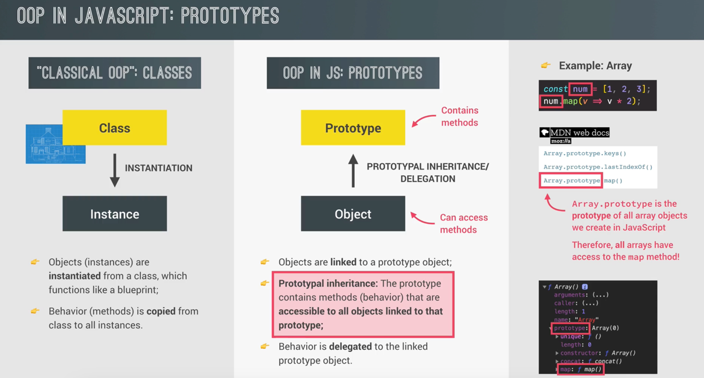

### Constructor 构造函数：

```javascript
// 定义一个Person类的构造函数
const Person = function (name, age) {
    this.name = name;
    this.age = age;
}

// 使用构造函数实例化一个person对象
const person = new Person("krian", 18);
```

通过 `new`关键字 调用构造函数创建的对象都会带有一个`prototype`属性，创建出来的对象可以访问`prototype`属性上绑定的方法和属性。
（PS：是直接调用，而不是通过`prototype`属性`.`方法名调用）

在构造函数的`prototype`属性上绑定方法（属性），就可以给基于此构造函数创建的对象增加方法（属性）：

```javascript
// 定义了Students的构造函数
function Students(name, height, age) {
    this.name = name;
    this.height = height;
    this.age = age;
    this.outputInfo  = function() {
        document.write('name = ' + this.name +  '<br\>' + 'height = ' + this.height + '<br\>');
    }
}

//增加一个新方法
Students.prototype.newFunction = function() {
    document.write('此方法是通过prototype继承后实现的');
}
```

#### 对象的 __proto__ 属性

每个 JavaScript 对象（除了 null）都自动拥有一个隐藏的属性 `__proto__`，它指向该对象的原型对象。这个 `__proto__` 是实现继承的关键：

```javascript
let obj = new Object();

// 输出: true, 即 obj 的原型是 Object.prototype
console.log(obj.__proto__ === Object.prototype); 
```

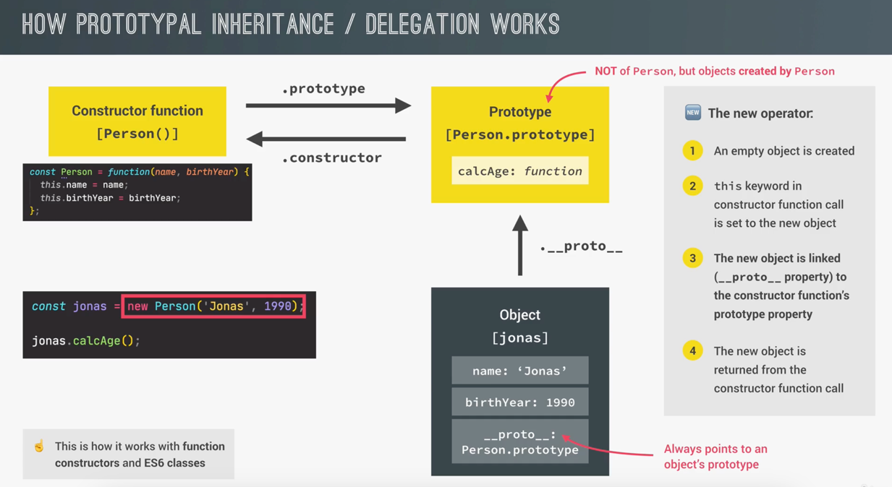

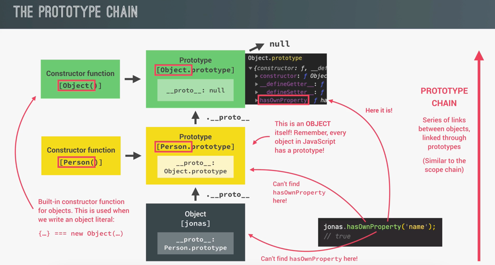


### ES6 Class

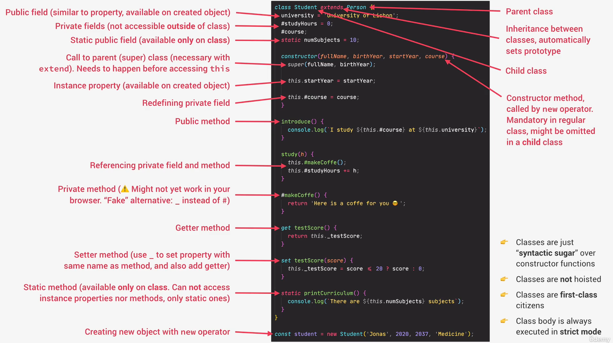

Class 是一种特殊的函数

```javascript
// class 表达式
const Person = class {
    // Class 定义
}
```

```javascript
// class 声明式
class Person {
    // Class 定义
}
```

使用 Class 定义一个类，能很好的集成属性和方法在类中，Class 会自动将其中定义的属性和方法绑定到类的.prototype属性上。

```javascript
class Person {
    constructor(name, age) {
        this.name = name;
        this.age = age;
    }
    
    // 定义方法
    showInfo() {
        console.log(this.name, this.age);
    }
}
```

1. 类的定义是没有进行提升的，使用Class必须是在其声明后。
2. 类和函数一样，类是特殊的构造函数，因此也是JavaScript的一等公民。意味着他可以被作为参数传递，也可以作为函数的返回值。
3. Class类{}代码块域始终是以严格模式执行的

#### Getter 和 Setter

```javascript
class Dog {
    // 构造方法
    constructor(name, age) {
        this.name = name;
        this._age = age;
    }
    
    run() {
        console.log("宇宙第一快");
    }
    
    // 获取需要带有返回值
    get age(){
        return this._age;
    }
    
    // 设值需要带有参数
    set age(a) {
        if (a < 0) a = 0;
        if (a > 20) a = 20;
        this._age = a
    }
}

// new class 事例对象
const d = new Dog("老黄", 9);

// 这里会调用setter进行赋值
d.age = 21; 

// 这里会调用getter获取函数的返回值
console.log(d.age);
```

#### 静态方法

类相当于实例的原型，所有在类中定义的方法，都会被实例继承。
如果在一个方法前，加上static关键字，就表示该方法不会被实例继承，而是直接通过类来调用，这就称为“静态方法”。

```javascript
class Fn {
    static classFn(){
        return "hello";
    }
}

console.log(Fn.classFn());  // hello

let fn = new Fn();
fn.classFn();  // Uncaught TypeError: fn.classFn is not a function
```

上面代码中，Fn类的classFn方法前有static关键字，表明该方法是一个静态方法，可以直接在Fn类上调用（ fn.classFn() )，而不是在Fn类的实例上调用。
如果在实例上调用静态方法，会抛出一个错误，表示不存在该方法。

注意，如果静态方法包含this关键字，这个this指的是类，而不是实例。

```javascript
class Fn {
    static car() {
        this.bur();
    }
    static bur() {
        console.log('hello');
    }
    bur() {
        console.log('world');
    }
}

Fn.car();  // hello
Fn.bur();  // 静态方法可以直接使用类调用
let f = new Fn();
f.bur();  // 普通方法则需要实例对象调用
```

#### Object.create() 创建对象

使用 `Object.create(构造函数)` 也可以创建对象。

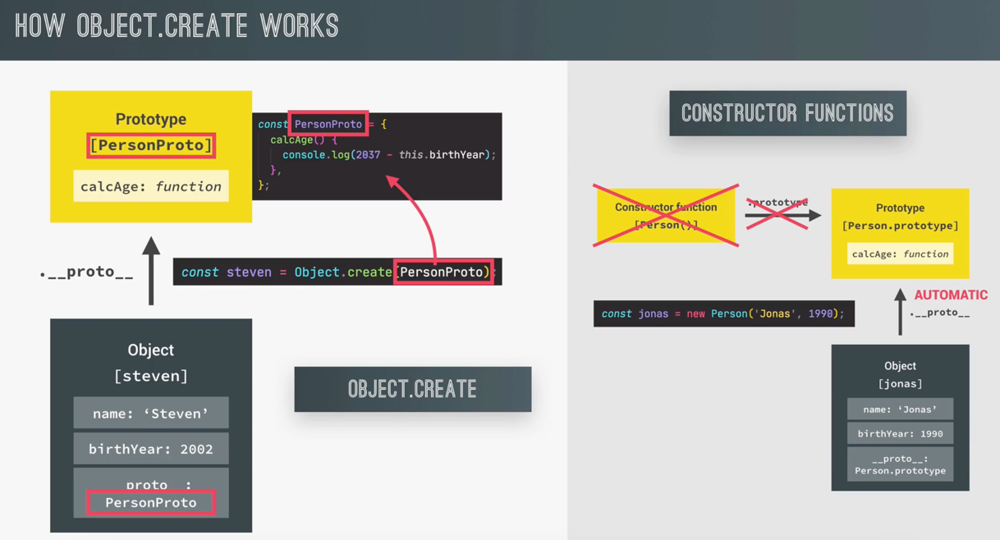

#### Class 继承

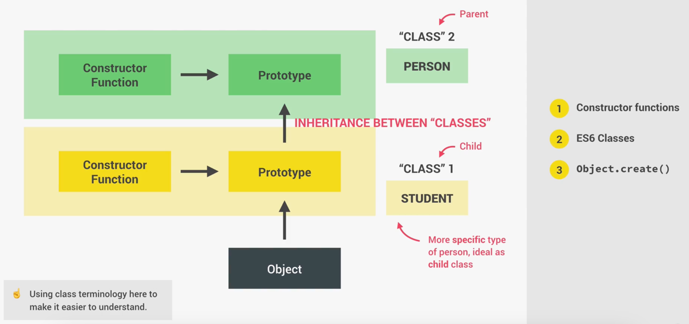

使用 `extends` 关键字实现 ES6+ 的类继承：

```javascript
class A {
    // Class 定义
}

class B extends A {
    // Class 定义
}
```

#### 数据隐私

使用 `_` 开头声明属性和方法来标识这是一个类内部属性和方法，避免对这样的属性和方法进行直接调用。

PS：这样只是一个约定，并没有强制的禁止直接调用下划线开头的属性和方法。

【ES6+】声明一个私有属性：使用 `#` 来声明一个属性和方法是私有的。

#### 链式调用

通过方法返回 `this` 来实现方法的链式调用。

---

## 如何构建一个项目？？？（地图APP）


