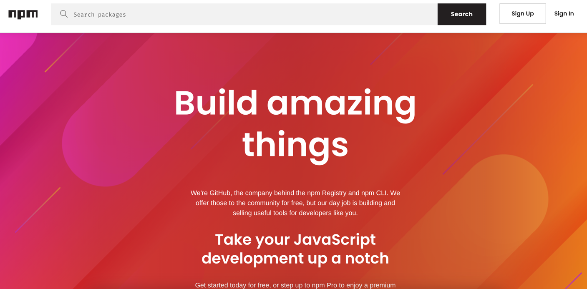
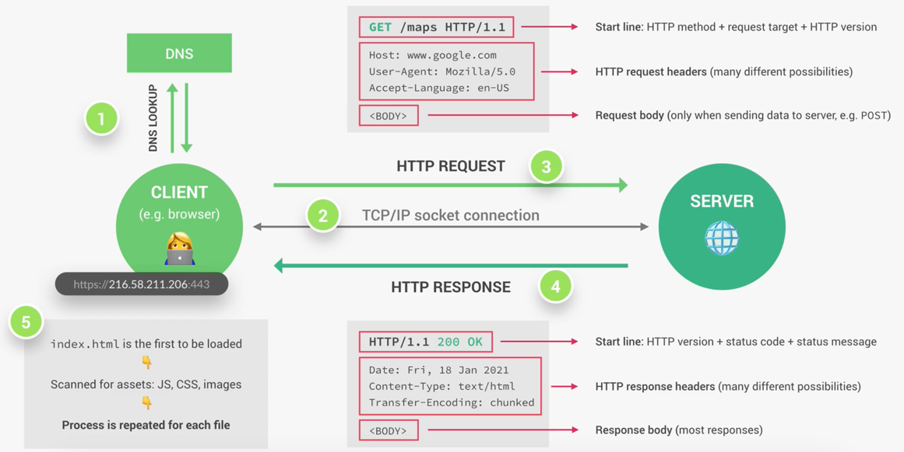
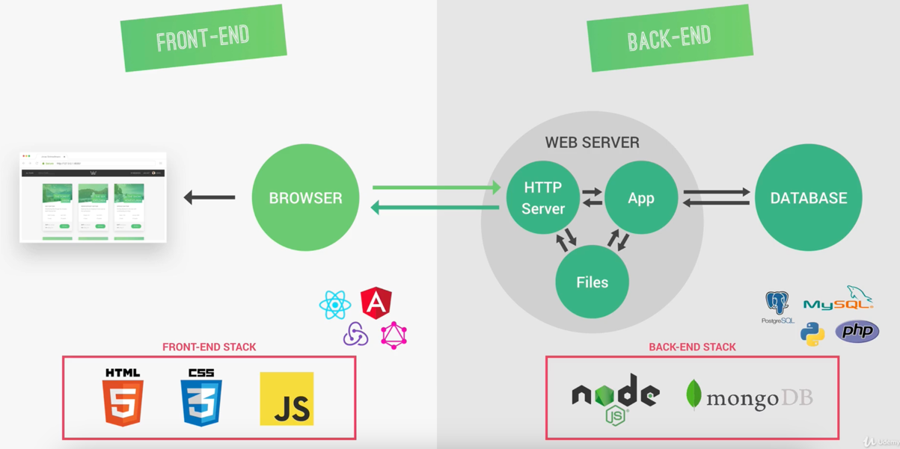
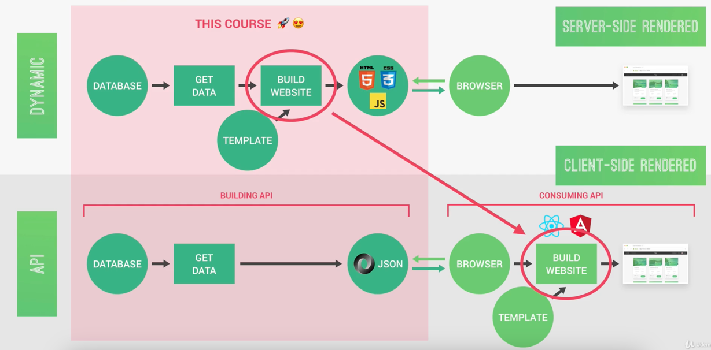
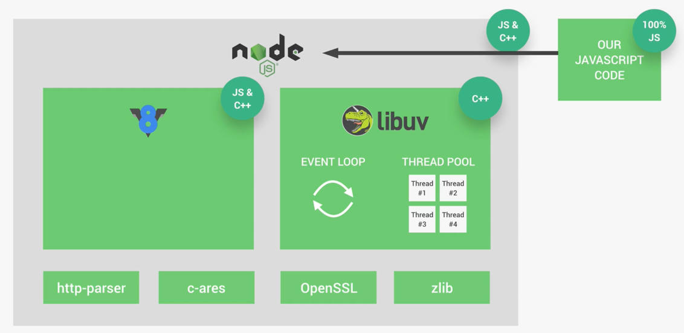
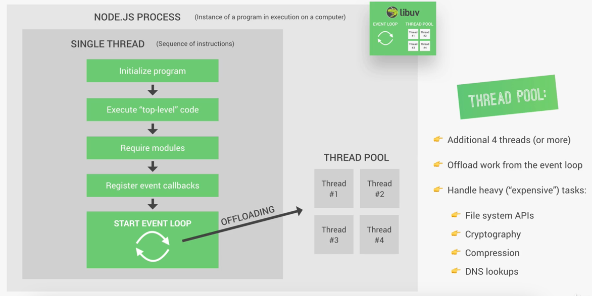

# Node JS

---

## Node JS 核心模块

NodeJs 官方API文档：https://nodejs.org/docs/latest-v22.x/api/index.html

---

### FS（File System）文件系统 模块

```javascript
// 使用commonjs包管理规则
const fs = require('fs');
```

- `readFileSync()`：从文件中读取数据（同步、阻塞）

```javascript
// 使用commonjs包管理规则
const fs = require('fs');

// 同步读取文件
const inputTxt = fs.readFileSync("./txt/input.txt", "utf8");
console.log(inputTxt);
```

- `writeFileSync()`：向文件写入数据（同步、阻塞）

```javascript
// 使用commonjs包管理规则
const fs = require('fs');

// 同步写入数据到文件
const outputText = `This is output data. Time is ${new Date().toLocaleTimeString()}`;
fs.writeFileSync("./txt/output.txt", outputText);
```

- `readFile('文件所在路径', 'utf8', callback回调函数)`：从文件中读取数据（异步、非阻塞）

```javascript
import { readFile } from 'node:fs';

// 回调函数接收两个参数：err执行时出现异常时传递；data执行成功时传递
readFile('/etc/passwd', (err, data) => {
    if (err) throw err;
    console.log(data);
});
```

- `writeFile()`：向文件写入数据（异步、非阻塞）

```javascript
const fs = require('fs');
const data = 'Hello, World!';

fs.writeFile('example.txt', data, (err) => {
    if (err) {
        console.error(err);
    } else {
        console.log('File written successfully');
    }
});
```

#### 阻塞、非阻塞（同步、异步）：


#### 回调地狱

使用 Promises 或者 Async/Await 来解决回调地域问题。

---

### HTTP 模块

```javascript
const http = require('http')

// 创建一个基于HTTP协议的服务
const server = http.createServer((req, res) => {
    console.log('HTTP server started');
    console.log(req);
    res.end('Hello from the http server');
});

// 设置服务端Socket监听
server.listen(8080, "127.0.0.1", () => {
    console.log("Listening on port 8080");
});
```

---

### URL 模块

Routing 路由

通过加载本地JSON文件，并进行JSON解析为一个对象，以HTTP的方式进行请求响应返回前端，实现API接口。

通过Node服务端可以使用HTML模板构建HTML文件，以HTTP的方式直接响应请求，返回HTML页面。

---

### 模块的导出和引入

#### 导出

`module.exports` 可以导出这个绑定的匿名函数

```javascript
// 使用module.exports属性
module.exports = () => {
    // 函数体
}
```

#### 导入

`require(模块)` 可以导入指定模块导出的数据

```javascript
const func = require("模块路径")
```

---

## ⚠️ 服务端响应类型汇总记录


---

## NPM 包管理器

NPM 官网地址：https://www.npmjs.com/



### NPM 初始化

- 初始化 NPM 项目（使用NPM管理项目）：

```shell
npm init
```

初始化完成之后会在项目的根目录生成一个`package.json`文件，这个文件中记录了项目的基本信息：

```json
{
  "name": "website",
  "version": "1.0.0",
  "description": "web site",
  "main": "index.js",
  "scripts": {
    "compile:sass": "node-sass sass/main.scss css/style.css -w"
  },
  "author": "krian",
  "license": "ISC",
  "devDependencies": {
    "node-sass": "8.0"
  }
}
```

### NPM 包安装

#### 安装三方包：

```shell
npm install 三方包名
```

PS：这里不再需要使用`--save`来指定包安装并记录到`dependences`依赖域中，默认就是带有`--save`的安装方式。

这里安装了一个字符串转换工具 `slugify`，（将字符串转换为URL友好的格式）

```shell
npm install slugify
```

安装一个开发依赖，则需要使用`--save-dev`：

```shell
npm install nodemon --save-dev
```

PS：这里需要使用`--save-dev`来指定安装的三方包是在开发阶段使用，在进行打包构建时不会被打包进入项目中。
在`package.json`中，开发依赖会被记录到`devDependences`依赖域中

#### NPM 全局安装：

使用全局安装后，这个包可以在电脑的任何位置使用

```shell
npm install --global
```

---

### NPM 包管理

#### 包版本号

- 查看包版本更新信息

- ^
- ~
- *

```shell
npm outdated
```

---

📌【经典面试题】当我我们访问一个网址时，整个过程发生了什么？







--- 

## Node 架构



### Thread Pool 线程池



### Event loop 事件循环