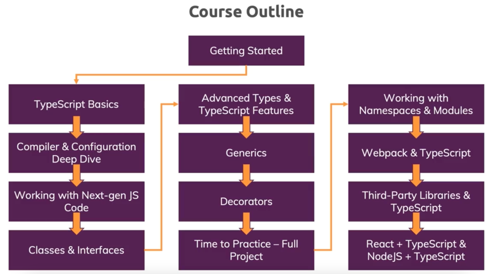
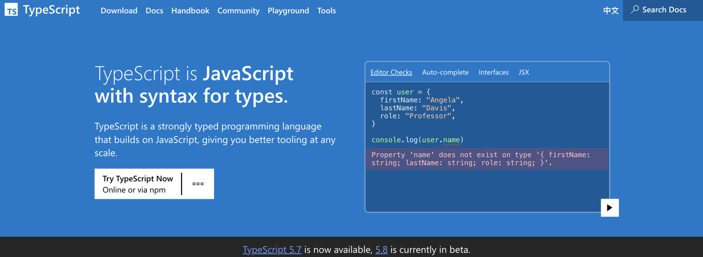

# TypeScript

---




---

## 安装并使用 TypeScript

- 官网地址：https://www.typescriptlang.org/
- 官方文档：https://www.typescriptlang.org/docs/



### 环境配置

#### 安装 TypeScript

- 项目开发依赖安装：

```shell
npm install typescript --save-dev
```

- 全局安装：

```shell
npm install -g typescript
```

#### 编译TS文件

```shell
tsc TS文件
```

---

lite-server

用于轻量级开发的节点服务器，为web应用程序提供服务，在浏览器中打开它，在html或javascript更改时刷新，使用套接字注入CSS更改，并在找不到路由时具有回退页面。

https://www.npmjs.com/package/lite-server

```shell
npm install lite-server --save-dev
```

