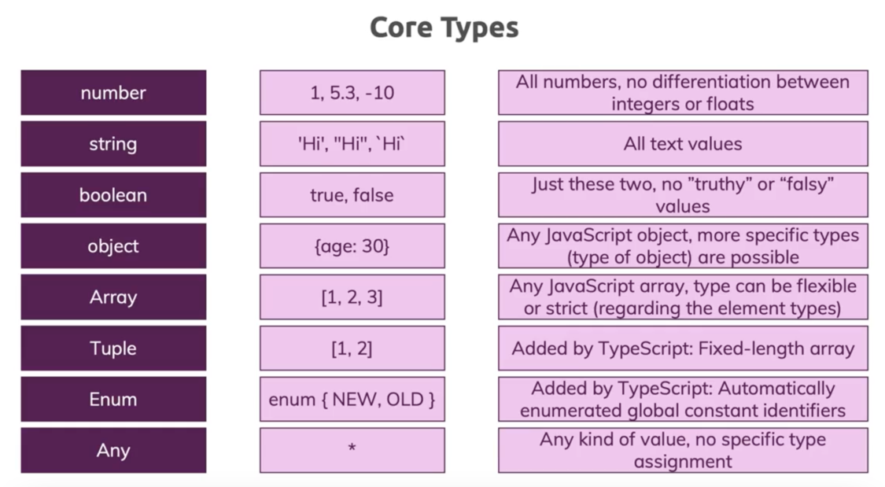
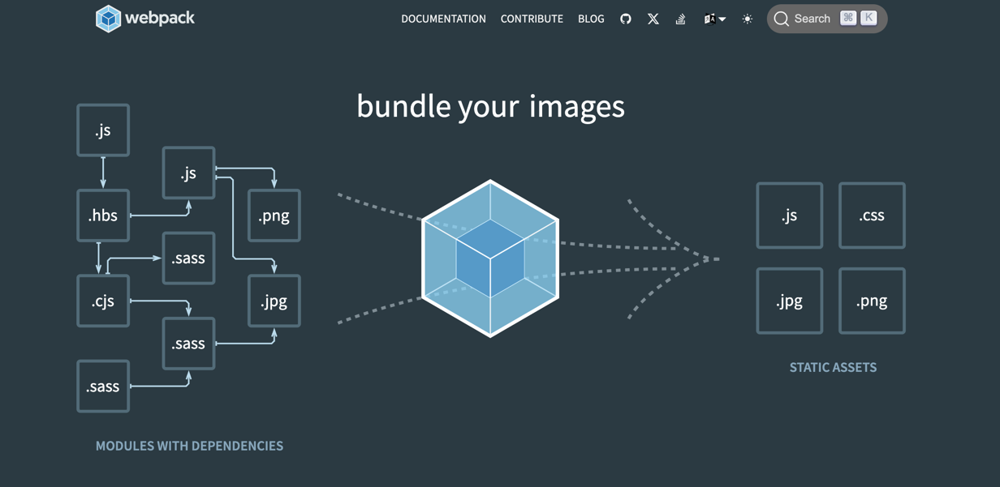

# TypeScript

---


---

## 安装并使用 TypeScript

- 官网地址：https://www.typescriptlang.org/
- 官方文档：https://www.typescriptlang.org/docs/


### 环境配置

#### 安装 TypeScript

- 项目开发依赖安装：

```shell
npm install typescript --save-dev
```

- 全局安装：

```shell
npm install -g typescript
```

#### 编译TS文件

```shell
tsc TS文件
```

---

lite-server

用于轻量级开发的节点服务器，为web应用程序提供服务，在浏览器中打开它，在html或javascript更改时刷新，使用套接字注入CSS更改，并在找不到路由时具有回退页面。

https://www.npmjs.com/package/lite-server

```shell
npm install lite-server --save-dev
```

---

## TypeScript 数据类型



PS：TypeScript 的类型系统只能在开发（编码）阶段辅助进行类型检查，TypeScript 最终会被编译成 JavaScript，而JavaScript本身不具备类型检查功能。

### 类型推断


### 联合数据类型


### 类型别名


### unknown 类型


### never 类型

---

## TypeScript 编译

监视TS脚本的更新，然后实时编译为JS文件（监听单个文件）

```shell
tsc index.ts --watch
```

### 多模块编译

在工程目录中执行这个命令后会自动生成一个`tsconfig.json`文件

```shell
tsc --init
```

此时执行 `tsc --watch` 就可以监视整个工程目录下的TS更新变化从而进行自动编译。

`tsconfig.json` 配置项：

- exclude：在`tsconfig.json`配置文件中，可以针对需要编译排除的文件进行配置：

```json
"exclude": [
    "node_modules"  // 这是一个默认的配置
]
```

- include：在`tsconfig.json`配置文件中，可以指定需要编译的TS文件：

```json
"include": [
  "index.ts"      // 这里指定的是需要编译的TS，如果没有在这个指定项中，则不会被编译
]
```

---

## TypeScript Class Interface

### Class

声明一个Class类，并事例化这个Class：

```typescript
// 声明一个Class类
class Person {
    // 声明一个name属性为string
    name: string;

    // 声明一个constructor构造函数，在执行事例化时调用执行
    constructor(name: string) {
        this.name = name;
    }

    // TypeScript Class 中定义方法不需要使用function 关键字
    showInfo() :void {
        // this 指向的当前class创建出来的实例对象
        console.log(this.name);
    }
}

// 创建一个对象
const person = new Person("Krian");
person.showInfo();
```

可以直接在 constructor 构造器 入参中声明属性，并在对象初始化时，给这些属性进行赋值。

```typescript
// 声明一个constructor构造函数
constructor(public name: string, private balance: number) {
    // 在使用new关键字时，给这个类的属性进行赋值
}
```

只读属性：使用 readonly 关键字修饰

```typescript
class Person {
    // 声明一个name属性为string
    name: string;

    // 使用readonly关键字声明一个只读属性
    constructor(readonly name: string) {
        this.name = name;
    }

    // TypeScript Class 中定义方法不需要使用function 关键字
    showInfo() :void {
        // this 指向的当前class创建出来的实例对象
        console.log(this.name);
    }
}
```

使用 private 关键字，声明一个属性为私有属性，提供 getter 和 setter 方法进行数据操作：

```typescript

```

静态属性和方法：使用 static 关键字进行修饰

```typescript

```

抽象类：使用 abstract 关键字声明一个抽象类 和 抽象方法

```typescript

```

单例对象 私有化构造器：

```typescript

```

#### 继承

使用 extends 关键字实现 Class类之间的继承关系

```typescript

```

使用 protected 关键字声明一个属性为受保护的，无法通过外部直接访问，但是能实现子父类之间继承和重写。

### Interface

interface 允许我们去定义一个对象的结构。

```typescript
// 使用interface关键字声明接口
interface Person {
    name: string;
    age: number;

    showInfo(): void;
}

// 初始化一个person对象
let person: Person;
person = {
    name: "krian",
    age: 24,
    showInfo() {
        console.log(this.name, this.age);
    }
}

person.showInfo();
```

class 通过 implements 实现接口（多实现）。

在 interface 内部声明属性时，可以使用 readonly 直接声明为只读属性。

在属性名后面加 ? 声明这个属性是可选的。

---

## TypeScript 泛型


---

## TypeScript Decorator 装饰器

使用 Decorator 需要在 tsconfig.json 中进行配置：

```json
 "experimentalDecorators": true
```

---

## TypeScript 结合 DOM

DOM 元素对应的TS的类型：

```ts
interface HTMLElementTagNameMap {
    "a": HTMLAnchorElement;
    "abbr": HTMLElement;
    "address": HTMLElement;
    "applet": HTMLAppletElement;
    "area": HTMLAreaElement;
    "article": HTMLElement;
    "aside": HTMLElement;
    "audio": HTMLAudioElement;
    "b": HTMLElement;
    "base": HTMLBaseElement;
    "bdi": HTMLElement;
    "bdo": HTMLElement;
    "blockquote": HTMLQuoteElement;
    "body": HTMLBodyElement;
    "br": HTMLBRElement;
    "button": HTMLButtonElement;
    "canvas": HTMLCanvasElement;
    "caption": HTMLTableCaptionElement;
    "cite": HTMLElement;
    "code": HTMLElement;
    "col": HTMLTableColElement;
    "colgroup": HTMLTableColElement;
    "data": HTMLDataElement;
    "datalist": HTMLDataListElement;
    "dd": HTMLElement;
    "del": HTMLModElement;
    "details": HTMLDetailsElement;
    "dfn": HTMLElement;
    "dialog": HTMLDialogElement;
    "dir": HTMLDirectoryElement;
    "div": HTMLDivElement;
    "dl": HTMLDListElement;
    "dt": HTMLElement;
    "em": HTMLElement;
    "embed": HTMLEmbedElement;
    "fieldset": HTMLFieldSetElement;
    "figcaption": HTMLElement;
    "figure": HTMLElement;
    "font": HTMLFontElement;
    "footer": HTMLElement;
    "form": HTMLFormElement;
    "frame": HTMLFrameElement;
    "frameset": HTMLFrameSetElement;
    "h1": HTMLHeadingElement;
    "h2": HTMLHeadingElement;
    "h3": HTMLHeadingElement;
    "h4": HTMLHeadingElement;
    "h5": HTMLHeadingElement;
    "h6": HTMLHeadingElement;
    "head": HTMLHeadElement;
    "header": HTMLElement;
    "hgroup": HTMLElement;
    "hr": HTMLHRElement;
    "html": HTMLHtmlElement;
    "i": HTMLElement;
    "iframe": HTMLIFrameElement;
    "img": HTMLImageElement;
    "input": HTMLInputElement;
    "ins": HTMLModElement;
    "kbd": HTMLElement;
    "label": HTMLLabelElement;
    "legend": HTMLLegendElement;
    "li": HTMLLIElement;
    "link": HTMLLinkElement;
    "main": HTMLElement;
    "map": HTMLMapElement;
    "mark": HTMLElement;
    "marquee": HTMLMarqueeElement;
    "menu": HTMLMenuElement;
    "meta": HTMLMetaElement;
    "meter": HTMLMeterElement;
    "nav": HTMLElement;
    "noscript": HTMLElement;
    "object": HTMLObjectElement;
    "ol": HTMLOListElement;
    "optgroup": HTMLOptGroupElement;
    "option": HTMLOptionElement;
    "output": HTMLOutputElement;
    "p": HTMLParagraphElement;
    "param": HTMLParamElement;
    "picture": HTMLPictureElement;
    "pre": HTMLPreElement;
    "progress": HTMLProgressElement;
    "q": HTMLQuoteElement;
    "rp": HTMLElement;
    "rt": HTMLElement;
    "ruby": HTMLElement;
    "s": HTMLElement;
    "samp": HTMLElement;
    "script": HTMLScriptElement;
    "section": HTMLElement;
    "select": HTMLSelectElement;
    "slot": HTMLSlotElement;
    "small": HTMLElement;
    "source": HTMLSourceElement;
    "span": HTMLSpanElement;
    "strong": HTMLElement;
    "style": HTMLStyleElement;
    "sub": HTMLElement;
    "summary": HTMLElement;
    "sup": HTMLElement;
    "table": HTMLTableElement;
    "tbody": HTMLTableSectionElement;
    "td": HTMLTableDataCellElement;
    "template": HTMLTemplateElement;
    "textarea": HTMLTextAreaElement;
    "tfoot": HTMLTableSectionElement;
    "th": HTMLTableHeaderCellElement;
    "thead": HTMLTableSectionElement;
    "time": HTMLTimeElement;
    "title": HTMLTitleElement;
    "tr": HTMLTableRowElement;
    "track": HTMLTrackElement;
    "u": HTMLElement;
    "ul": HTMLUListElement;
    "var": HTMLElement;
    "video": HTMLVideoElement;
    "wbr": HTMLElement;
}
```

当我们使用`getElementById`等等其他方法获取元素时，返回结果可能为`null`，但是我们能确保在 HTML 中我们一定能拿到这个元素，可以使用 ! 声明一定可以获取到对应元素。

```ts
const appDom = document.getElementById("app")! as HTMLDivElement;
```

---

## TypeScript 多文件 Multiple Files

### namespace

```ts
namespace 空间名 {
    // 声明interface
}
```

```ts
/// <refrence path='xxx.ts'/>
```

### ES module


 
---

## TypeScript 结合 Webpack

https://webpack.js.org/



安装指令：

```shell
npm install --save-dev webpack webpack-cli webpack-dev-server 
```

```shell
npm install --save-dev typescript ts-loader
```

package.json

```json
"devDependencies": {
    "ts-loader": "^9.5.2",
    "typescript": "^5.7.3",
    "webpack": "^5.98.0",
    "webpack-cli": "^6.0.1",
    "webpack-dev-server": "^5.2.0"
}
```

```shell
npm install --save-dev clean-webpack-plugin
```

---

## TypeScript 结合 三方库

### Lodash

解决TS不识别JS原生三方库抛出异常问题

```shell
npm install --save-dev @type/lodash
```

使用 declare 关键字声明变量存在

### class-transformer


### class-validator


### TypeScript 结合 Axios

---

## TypeScript 结合 Vue

- 官网文档：https://cn.vuejs.org/guide/typescript/overview


---

## TypeScript 结合 Node


```shell

```

